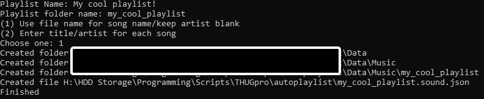

# Scripts
A place where I dump random scripts I make

# THUG Pro
[Convert all .bik in folder in to a usable playlist](makeplaylist.py)
To use:
1) Place the script in a folder with the .bik files of choice
2) Run the script, select an option and type in values if necessary
3) Copy the resulting Data folder and .sound.json file in to %localappdata%\THUG Pro\User\

